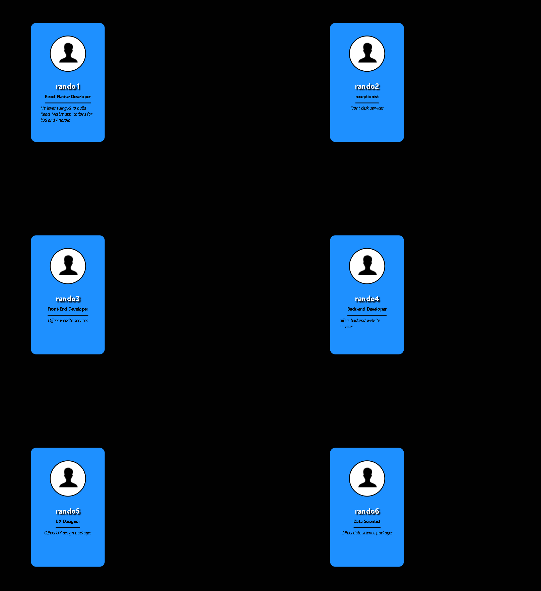
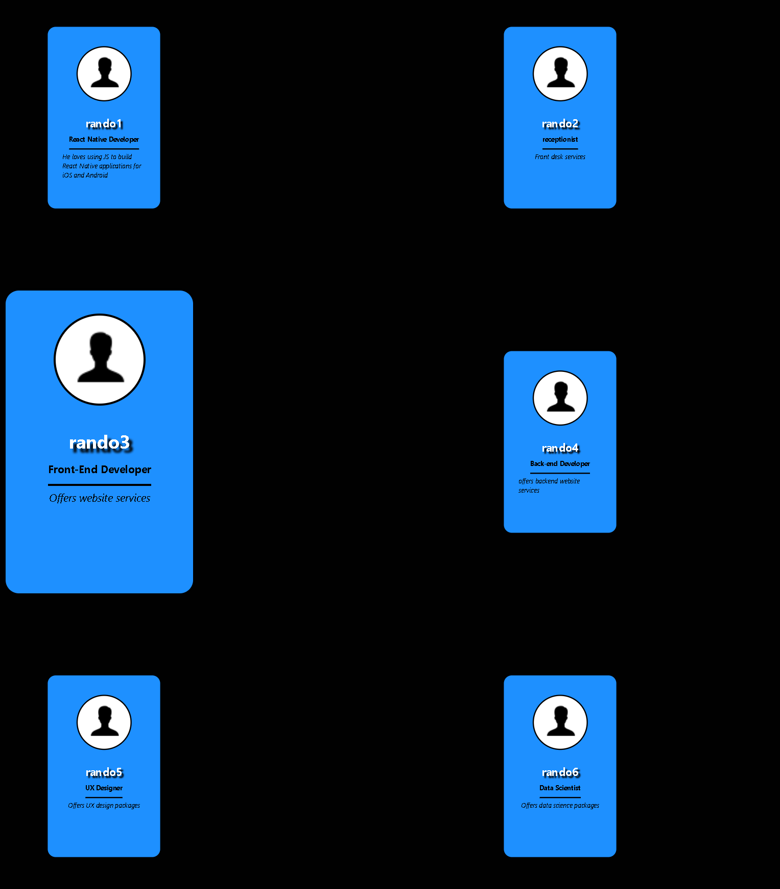

# CS624_PE04_MorrisChristian

# Input
The application contains 6 profile cards The profile cards are available for Thumnails for expand and collapse

# Process:
The implementation starts with creating one profile card that contains the person’s name, job title, and a description. The profile card can be clicked to expand and collapse as a thumbnail. After the implementation is completed, continue to expand the same process for an addition of 5 profile cards with the same setting

# Output:
The App GUI shows 6 profile cards in 2 columns and each column contains 3 cards, each card can be clicked to be resized.

### Preview

